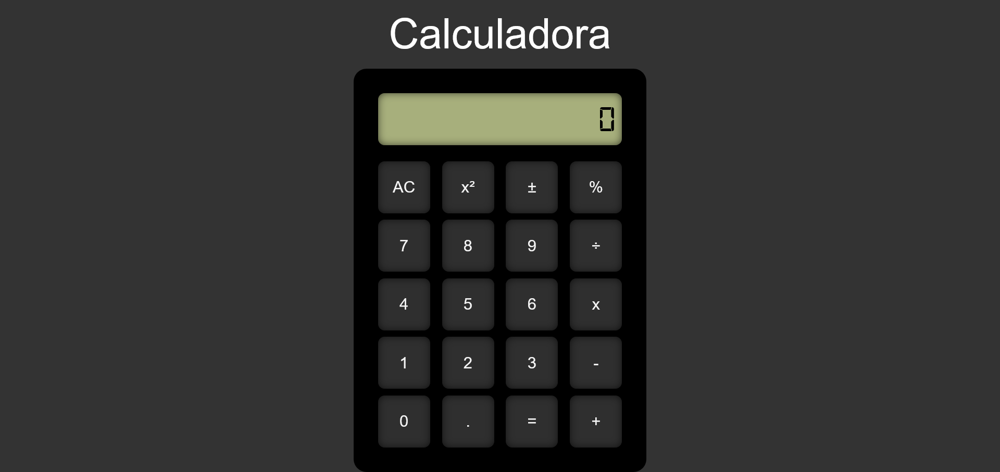

# 🧮 Calculator React

Uma calculadora de números de 0 a 10, feito com a biblioteca React JavaScript.

## 📚 Tabela de Conteúdos

- [🧮 Calculator React](#-calculator-react)
  - [📚 Tabela de Conteúdos](#-tabela-de-conteúdos)
  - [📋 Descrição](#-descrição)
    - [🚀 Funcionalidades](#-funcionalidades)
    - [🌐 Acesso](#-acesso)
    - [📸 Prévia](#-prévia)
  - [⚙️ Construção](#️-construção)
    - [💻 Tecnologias](#-tecnologias)
    - [🛠️ Ferramentas](#️-ferramentas)
    - [📌 Versão](#-versão)
  - [✏️ Aprendizado](#️-aprendizado)
  - [✒️ Autores](#️-autores)
  - [🎁 Agradecimentos](#-agradecimentos)
  - [📨 Contato](#-contato)

## 📋 Descrição

Este é um projeto de uma calculadora.
Esse projeto foi lançado como o desafio 03 do módulo 02 do curso de front-end do "Vai na Web". Sua principal proposta era colocar os conhecimento de lógica de programação com a linguagem JavaScript e a biblioteca React JavaScript em prática, utilizando todos os recursos aprendidos ao longo das aulas. O modelo a ser seguido foi apresentado em aula.

### 🚀 Funcionalidades

As funcionalidades disponíveis para os usuários estão listadas abaixo:

- Realizar as 4 operações matemáticas básicas: adição, subtração, multiplicação e divisão
- Calcular o resto de uma divisão
- Inverter o sinal de um valor numérico
- Calcular o quadrado de um valor numérico
- Detectar quando uma operação inválida no contexto matemático foi executada
- Utilizar uma calculadora completa e eficiente

### 🌐 Acesso

🖇️ [Clique aqui para acessar o projeto](https://milton-salgado.github.io/calculator-react/)

### 📸 Prévia

  

## ⚙️ Construção

Resumo geral dos recursos utilizados na construção do projeto.

### 💻 Tecnologias

Tecnologias utilizadas na construção do projeto:

### 🛠️ Ferramentas

Ferramentas utilizadas na construção do projeto:

### 📌 Versão

Utilizei o Git para o controle de versão. 

Versão atual: 1.0 (primeira versão)

## ✏️ Aprendizado

Ao fazer esse projeto, aprendi a:

- Construir um projeto totalmente do zero utilizando React JavaScript
- Revisar a componentização e a utilização de hooks em React JavaScript
- Consolidar a lógica de programação em JavaScript
- Tirar proveito das funções nativas da linguagem JavaScript para reduzir os códigos
- Criar uma calculadora completa e eficiente utilizando a biblioteca React JavaScript

## ✒️ Autores

* **Milton Salgado Leandro** - *Todo o Projeto* - [GitHub](https://github.com/milton-salgado)

## 🎁 Agradecimentos

* Agradeço ao instrutor João Pedro Belo e aos facilitadores Merry Esperança e Naiara Souza pelo auxílio no meu processo de aprendizagem e apoio na construção do projeto.
* Agradeço também a você, visitante, por visualizar o meu projeto!

## 📨 Contato

